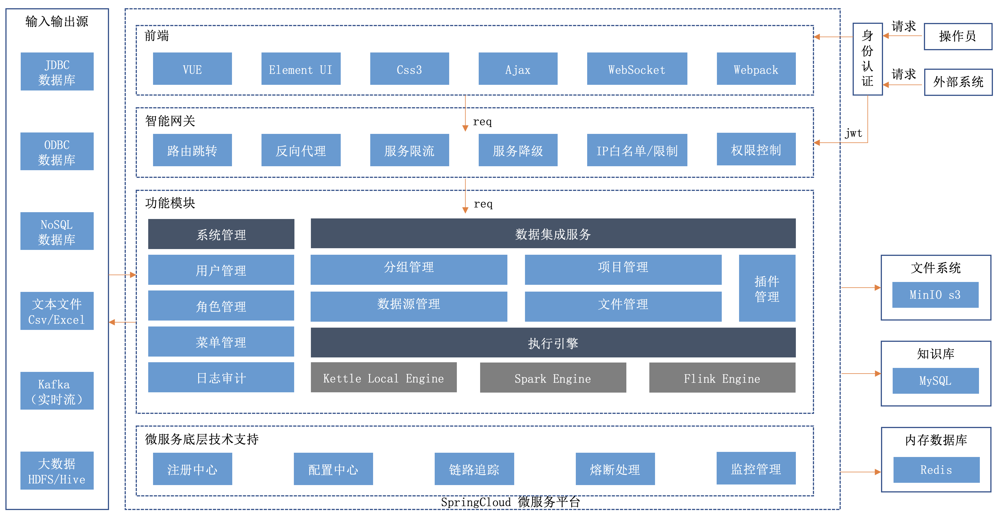
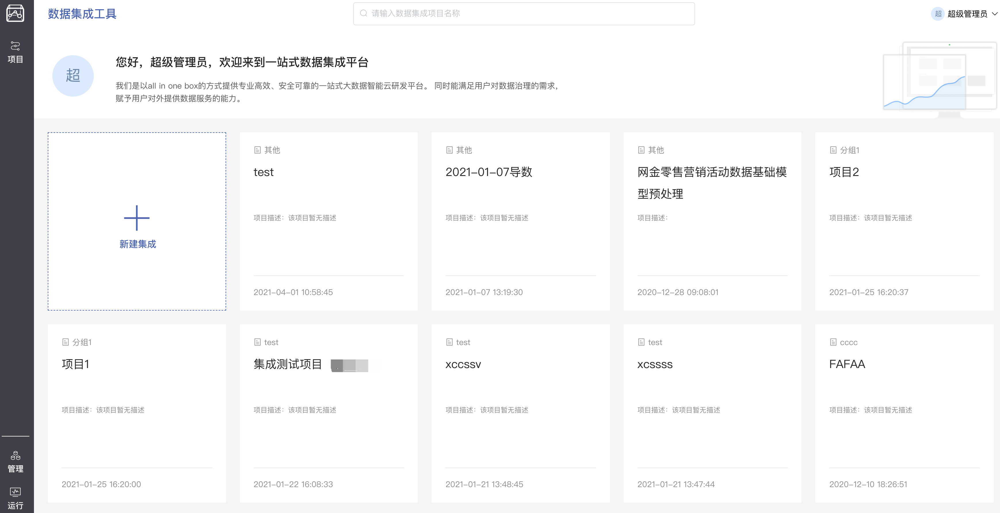
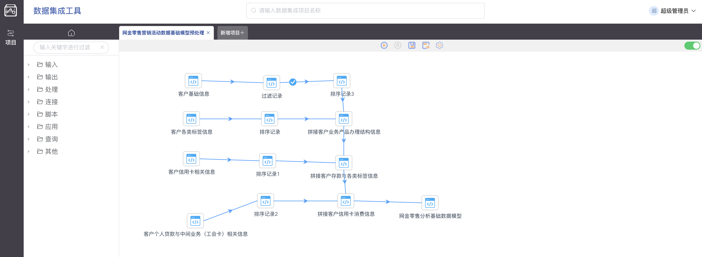
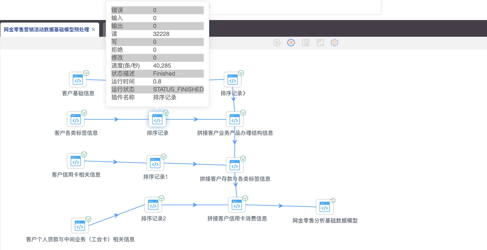
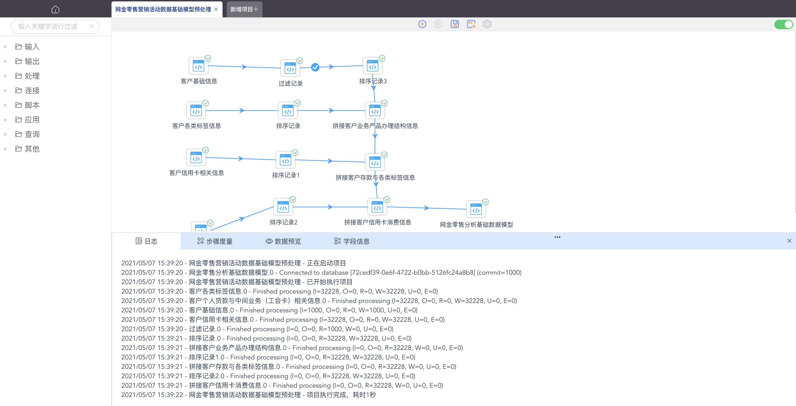

<p align="center">
  <strong>基于kettle的可视化数据集成平台</strong>
</p>

<p align="center">
  <a href="https://github.com/young-datafan/data-integration/blob/develop/README.md">English</a> | 简体中文
</p>

<p align="center">
    <a target="_blank" href="https://github.com/young-datafan/data-integration/blob/develop/LICENSE">
        
    </a>
    <a target="_blank" href="https://www.oracle.com/technetwork/java/javase/downloads/index.html">
        
    </a>
</p>
<br/>

--------------------------------------------------------------------------------

# 架构



--------------------------------------------------------------------------------

# 模块

* dataintegration-common : 公共模块
* dataintegration-group : 分组管理
* dataintegration-gateway : 服务网关
* dataintegration-project : 脚本管理
* dataintegration-run : 数据集成运行模块
* dataintegration-sso : sso单点登录模块
* dataintegration-sys : 系统管理模块
* dataintegration-model : 模型管理
* dataintegration-file-management : 文件管理
* dataintegration-ui : 前端vue模块

--------------------------------------------------------------------------------

# 功能特点

基于kettle实现的web版数据集成平台，致力于提供web可拖拽的数据集成平台。

其主要特点有：
* vue2+springCloud架构（后续支持vue3）
* 支持kettle本地引擎，后续扩展spark引擎
* 支持ftp/s3协议的文件读取

由于公司采用springcloud微服务架构开发整个数据中台产品，数据集成属于其中的一个子模块，所以暂时还是采用springcloud的架构进行开源，便于版本统一。

--------------------------------------------------------------------------------

# 用户界面截图






--------------------------------------------------------------------------------

# 近期研发计划

新版也在同步研发中，后续会开放

--------------------------------------------------------------------------------

# 参与贡献

非常欢迎大家来参与贡献，贡献流程请参考：
TODO

--------------------------------------------------------------------------------

# 快速试用 Docker
```shell
# 安装nodejs12
sudo sh nodejs12.sh

# 前端构建node-sass需要python27 也可以直接二进制包安装`npm install node-sass --sass_binary_site=https://npm.taobao.org/mirrors/node-sass/`
conda create -n python27 python=2.7
conda activate python27

# 执行安装
cd install && sudo sh install.sh 192.168.50.104

# 导入sql
sudo docker cp sql/dataintegration.sql mysql:/tmp
sudo docker exec -it mysql /bin/sh
mysql -uroot -p 123456
create database dataintegration;
use dataintegration;
source /tmp/dataintegration.sql

sudo docker-compse down
sudo docker-compse up -d

vs: http://127.0.0.1:18180/dataintegration-ui/#/ admin Prime@2020

```
可以参考：http://www.young-datafan.com/docs-data-integration/quick-start/installation-docker/. 这个文档部署演示

--------------------------------------------------------------------------------

# 如何构建
## 打包项目
```bash
mvn -B clean compile install -Prelease -Dmaven.test.skip=true -Dcheckstyle.skip=true
```
## 启动前置环境
* <a  href ="https://www.oracle.com/technetwork/java/javase/downloads/jdk8-downloads-2133151.html">Jdk1.8</a>
* <a  href ="https://www.mysql.com/">Mysql 5.7.+</a>
* <a  href ="https://docs.consulproject.org/docs/english-documentation/introduction/local_installation">consul</a>
* <a  href ="https://redis.io/">Redis</a>
* <a  href ="">Nodejs v12.+</a>
* <a  href ="">Python 2.7</a>

### 创建数据库
> 使用数据库连接工具连接数据库，创建数据库dataintegration，将项目/install/sql/dataintegration.sql导入数据库中，初始化数据库文件。
### 服务启动
#### 修改配置
* dataintegration-gateway : 服务网关
* dataintegration-group : 分组管理
* dataintegration-project : 脚本管理
* dataintegration-run : 数据集成运行模块
* dataintegration-sso : sso单点登录模块
* dataintegration-sys : 系统管理模块
* dataintegration-model : 模型管理
* dataintegration-file-management : 文件管理

``` bash
 依次修改 application-local.yaml
 spring.cloud.consul.host: 127.0.0.1 ,ip改为启动的consul IP
 spring.cloud.consul.port: 8500 ,ip改为启动的consul 端口
 spring.datasource.url: jdbc:mysql://127.0.0.1:3306/ 修改启动的mysql url
 spring.datasource.username:  修改启动的mysql的账号
 spring.datasource.password:  修改启动的mysql的密码
 使用idea或者其他工具运行服务 dataintegration-**-provider
```

#### 启动前端ui
> 终端进入 dataintegration-ui 目录

``` bash
# install dependencies
npm install

# serve with hot reload at localhost:8080
npm run dev

```
> 访问前端页面：http://127.0.0.1:8081/dataintegration-ui/#/  默认的用户是admin，默认的密码是Prime@2020

###


--------------------------------------------------------------------------------

# 获得帮助

1. 提交[issue](https://github.com/young-datafan/data-integration/issues)

--------------------------------------------------------------------------------

## 版权

请参考 [LICENSE](https://github.com/young-datafan/data-integration/blob/develop/LICENSE) 文件.

--------------------------------------------------------------------------------

## 其他
consul 1.9.4
```shell
sudo docker pull consul:1.9.4

sudo docker run -it -d -p 8500:8500 --name consul \
-v /usr/consul/single/data:$HOME/consul/data consul:1.9.4 \
agent -server -node node-1 -bootstrap-expect 1 -client=0.0.0.0 -ui
```